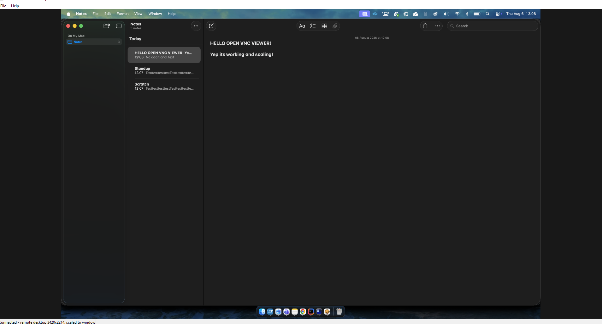
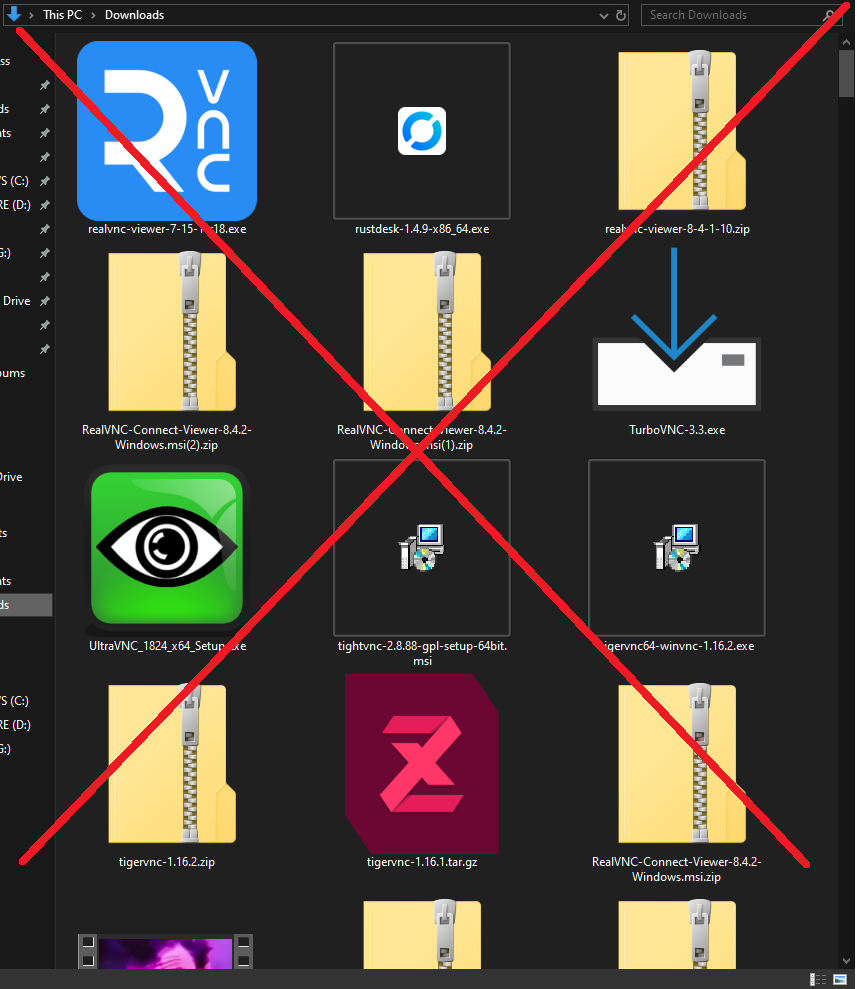
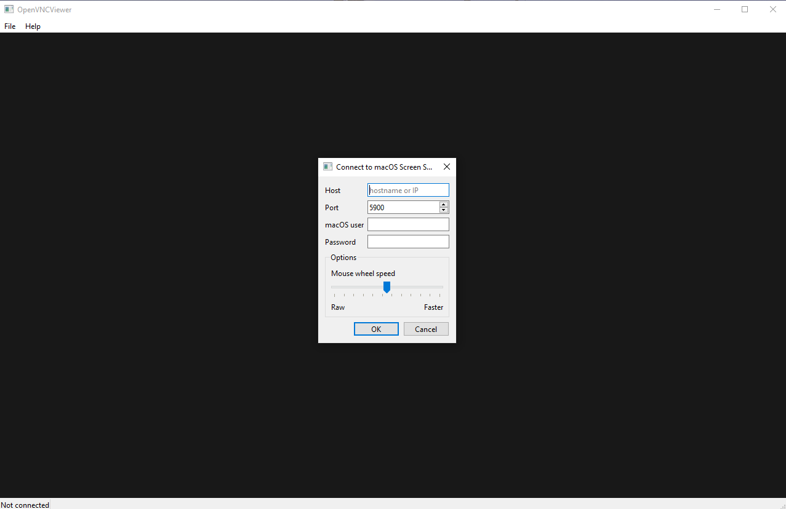

# OpenVNCViewer for Windows

**A VNC viewer for 64-bit Windows, with support for macOS Screen Sharing and
standard VNC servers.**

[](https://github.com/riazhassan-za/openvncviewer/actions/workflows/ci.yml)
[](LICENSE)
[](#platform-support)

It scales the remote desktop to whatever size the client window happens to be.
It logs in to **macOS Screen Sharing** with a real macOS account name and
password, and also connects to **standard VNC servers** using the ordinary VNC
password.

Most viewers make you choose between a 1:1 window the size of the Mac's display
and a scrollable viewport. This one always fits the desktop to the window,
rescaling live as you drag the window edge.



*A 3420x2214 Retina desktop rendered into a smaller window. Drag the window
edge and it rescales live — the Mac's own resolution is never touched.*

## Why this exists

Two things are awkward with the usual Windows VNC clients against a Mac:

1. **Logging in with a macOS account.** macOS offers RFB security type 30
   ("ARD"), which takes a normal account name and password. Many clients only
   implement the legacy 8-character VNC password (type 2), which requires
   turning on a separate, weaker option on the Mac.
2. **Scaling.** A 3420x2214 Retina desktop on a 1920x1080 monitor is
   unusable without client-side scaling.



The clients above are all perfectly good software — this is not a claim that
they are broken. They were tried first and none of them did *both* of the
things above together on Windows: log in with a plain macOS account name and
password, and continuously refit a Retina desktop to the window. TigerVNC in
particular connects happily; it just will not scale to the window. Rather than
fight that, this exists.

## Requirements

**This is a Windows x64 application.** It runs on 64-bit Windows 10 (1809 or
later) and Windows 11, and nothing else — see [Platform support](#platform-support)
below for exactly what that rules out and why.

Connect it to either:

- a Mac with **System Settings → General → Sharing → Screen Sharing**
  enabled and your account allowed access, or
- any VNC server offering password authentication or no authentication

For a Mac, the legacy "VNC viewers may control screen with password" option is
**not** needed — the viewer logs in with the account itself.

## Platform support

| | |
| --- | --- |
| **This viewer runs on** | 64-bit (x64) Windows 10 1809+ and Windows 11 |
| **It connects to** | macOS Screen Sharing, and standard VNC servers on any OS |

Two separate things, worth not confusing. The **viewer** is a Windows x64
application and is not built for anything else. What it **talks to** is
unrestricted — a VNC server is a VNC server whether it runs on macOS, Linux or
Windows.

The code beneath the UI is portable Python and carries no Windows assumptions
in the protocol layer, but only Windows has been exercised, the keyboard
mapping assumes a PC keyboard, and saved-password encryption is Windows DPAPI.
Treat "Windows x64" as the supported target, not an accident of packaging.

See [Install](#prebuilt-executable) for which Windows versions and
architectures are ruled out, and [TODO.md](TODO.md) §2 for what changing that
would take.

## Which servers work

| Server offers | Fill in | Notes |
| --- | --- | --- |
| Apple ARD (type 30) | Username **and** password | macOS accounts, any password length |
| VNC password (type 2) | Password only, **leave Username blank** | Most non-Apple servers |
| No authentication (type 1) | Neither | |

The viewer picks the strongest scheme it can satisfy from what the server
offers and what you filled in: ARD when you gave a username, otherwise the VNC
password, otherwise none. RFB 3.3, 3.7 and 3.8 servers are all handled.

Not supported: Tight security (16), TLS/VeNCrypt (18/19), and Apple's RSA-AES
variants (31/32/33/35). A server that *requires* one of those cannot be
connected to.

## Install

### Prebuilt executable

Download from the
[latest release](https://github.com/riazhassan-za/openvncviewer/releases):

`OpenVNCViewer-x64.exe` — a single file with Python, PySide6 and cryptography
bundled, for 64-bit Windows 10 (1809+) or Windows 11. Nothing to install. It is
unsigned, so SmartScreen will warn on first run; `SHA256SUMS.txt` on the release
lets you verify what you downloaded.

**32-bit Windows, Windows 7/8 and ARM64 are not supported**, and none of those
is an oversight:

- **32-bit** — PySide6 has never published a 32-bit wheel, in any release.
- **Windows 7/8** — Qt 6 requires Windows 10, so even a 64-bit build cannot run.
- **ARM64** — PySide6 does publish an ARM64 wheel, but `cryptography` dropped
  its Windows ARM64 wheel after 46.0.3. Building it would mean shipping a
  crypto library four major versions behind in an app that handles passwords.

[TODO.md](TODO.md) §2 has the detail, including what supporting them would
take.

### From source

```
git clone https://github.com/riazhassan-za/openvncviewer.git
cd openvncviewer
python -m venv .venv
.venv\Scripts\python.exe -m pip install -e .
```

## Run

```
.venv\Scripts\python.exe -m openvncviewer
.venv\Scripts\python.exe -m openvncviewer --host mac.local --user myaccount
```

Or, once installed, just `openvncviewer`.

The main window opens without a connection dialog. Use **File → Connect** or
**+ New** in the server sidebar to open one. `--host`, `--port` and `--user`
prefill the dialog opened from **File → Connect**. The password is always typed
into the dialog — never passed on the command line, where it would land in
shell history and the process list.

## Scaling

The remote framebuffer is drawn scaled to the window on every repaint, with a
smooth transform and the aspect ratio preserved (letterboxed or pillarboxed as
needed). Resizing the window rescales immediately — nothing is renegotiated
with the server and the Mac's own resolution is left alone.

Mouse positions are mapped back through the same scale, so clicks land where
you point at any window size. Clicks in the letterbox area clamp to the nearest
remote pixel.

This holds at Windows display scaling above 100%: the scaled image is cached in
**device** pixels, so a 150% or 200% display gets the full resolution it can
show rather than a stretched copy, and clicks stay exact.

## Recent servers

The **Host** box is a dropdown of servers you have connected to before, most
recent first. Picking one fills in its **Server name**, port and username —
restoring all three together, since a leftover username from the previous
server is exactly what breaks a Mac-then-standard-VNC switch.

**Server name** is a label of your choosing. It appears next to the host in the
dropdown, and in the window title and status bar once connected, which is what
makes several open viewers tellable apart. Typing a host you have never
connected to clears the name, ready for a new one.

A server joins the list only once it has **actually connected**, so typos and
unreachable hosts never accumulate. **Remove Server** forgets the one currently
shown, along with any password saved for it, and then selects the next — so
three servers take three clicks. It is disabled when the host in the box is not
in the list.

The list lives in `servers.json` under your user config directory —
`%LOCALAPPDATA%\OpenVNCViewer\` on Windows, which is where Qt's
`AppConfigLocation` points, **not** the roaming `%APPDATA%`. It holds
hostnames, ports, usernames and your names for them, and is written
atomically, so a crash mid-save leaves the previous list intact rather than a
corrupt file.

### Saved servers sidebar

A left sidebar lists servers you have connected to. **Double-click** an entry
to reconnect with its saved credentials, or right-click it for **Connect**,
**Disconnect**, **Edit**, **Delete**, and **Properties**. **Disconnect** stops
the current session.

**+ New** opens a blank connection dialog. **Edit** opens the same full dialog
with the selected server's host, port, credentials, and options filled in.
Pressing **Connect** uses those settings; the list updates after a successful
connection. The sidebar highlights the active server.

Servers are listed alphabetically by the name shown; tick **Sort by last
used** to put the most recent first. The sidebar opens at a fifth of the
window and can be dragged wider or narrower. **«** collapses it to a narrow
**»** button against the left edge, as does unticking **View → Show Sidebar**,
and it reopens at the width you left it.

### Saving passwords

**Save password for this server** is off by default. Tick it and the password
is encrypted with **Windows DPAPI**, whose key comes from your Windows login,
before being written alongside that server. Selecting the server later fills
the password in and re-ticks the box; unticking and reconnecting forgets it.

Be clear about what that protects:

- The stored blob is **useless on another machine, and useless to another user
  on this one**. Copying `servers.json` elsewhere gains an attacker nothing.
- It does **not** protect against code running as you. Anything in your Windows
  session can call `CryptUnprotectData` exactly as this does. Every browser
  password store works the same way. If that matters, leave the box unticked.

The plaintext password never reaches `servers.json`, and the module that writes
that file cannot decrypt anything — it only stores an opaque token. On a
platform without DPAPI the option is **disabled** rather than falling back to a
key kept next to the ciphertext, which would be obfuscation, not encryption.

## Clipboard

Copy on either machine and paste on the other. **Share clipboard with this
server** is in the Options group of the connect dialog and is **on by default**.

> **macOS Screen Sharing does not carry the clipboard over RFB**, in either
> direction, so this option has no effect when connected to a Mac. Apple's own
> client shares the clipboard over a private channel rather than the standard
> `ClientCutText`/`ServerCutText` messages. Verified against macOS 14 with a
> traced session: outgoing messages leave correctly and are ignored, and no
> incoming message ever arrives — while the identical code round-trips both
> directions against a standard VNC server. There is no documented RFB way to
> reach the macOS pasteboard, so this is not something the viewer can fix.

Against standard VNC servers it works in both directions. Two things worth
knowing there, both inherent to the base RFB protocol:

- **Anything you copy locally is sent to the server**, and RFB carries it in
  the clear. Copy a password on this machine and it goes over the wire to
  whatever you are connected to. Untick the box when that matters.
- **Clipboard text is Latin-1.** Plain text and accented characters survive;
  emoji and CJK have no representation and are replaced with `?`. That is the
  protocol, not this viewer. The Extended Clipboard pseudo-encoding would give
  UTF-8 — see [TODO.md](TODO.md) §3.

Windows CRLF line endings are converted to the bare LF the protocol requires,
and back, so pasted text does not arrive with doubled or missing line breaks.
A trailing NUL — which some Windows applications leave on the clipboard — is
stripped rather than forwarded. Text over 1 MB is not shared.

## Text input via simulated key presses

While connected, **Ctrl+Shift+V** opens a dialog that sends text as individual
key presses instead of using the remote clipboard. This is useful when the
server does not support clipboard sharing, including macOS Screen Sharing.

The dialog offers two modes:

- **From Clipboard**: Send text directly from your clipboard (shown as a preview)
- **Enter Text**: Type or paste text in the dialog

You can adjust the delay between key presses (10–500ms) to match your server's
responsiveness. The default is 50ms. Any character can be sent, including €,
smart quotes and non-Latin letters, as well as Enter and Tab; other control
characters are skipped.

**Security note:** Manual entry does not put text on the local clipboard; the
**From Clipboard** option reads text that is already there. Key events still
travel over the VNC connection, so use an encrypted connection when sending
sensitive text.

## Full screen

**View → Full screen**, or **F11**, hands the whole screen to the remote
desktop and hides the menu and status bars. F11 brings them back. Nothing is
renegotiated with the server — the scaler simply gets more room, so the remote
desktop is drawn larger.

Two things worth knowing:

- **F11 is reserved by the viewer** and is therefore not forwarded to the Mac.
  It is the only key treated this way — every other key, Alt included, is
  claimed for the remote rather than left to open a menu.
- There is **no keyboard grab**, so Windows still intercepts Alt+Tab, the
  Windows key and Ctrl+Alt+Del even in full screen. `Cmd+Tab` on the Mac is
  reachable only if Windows does not claim the combination first.

## Modifier keys

**Send Alt as Command (macOS)** is in the Options group and **on by default**,
so Alt+C and Alt+V copy and paste on the remote Mac. Two reasons:

- The key beside the space bar is Alt on a PC and **Command** on a Mac, so this
  is the positionally faithful mapping.
- It is the only one that actually works. Command was previously on the Windows
  key, and Windows keeps most Win+key combinations for itself — Win+V opens
  clipboard history rather than reaching the viewer.

With it on, the Windows key sends Option. **Untick it for a non-Apple server**,
where Alt should stay Alt.

While connected the viewer claims every keystroke except F11, so Alt reaches
the remote instead of opening the local menu bar. The menus remain available
with the mouse.

## Mouse wheel speed



RFB carries no scroll magnitude — a wheel notch is just a button press, so the
server has no idea how hard you spun the wheel. That is why scrolling a remote
session feels sluggish in most VNC clients however fast you scroll.

The **Options** group on the connect dialog compensates by multiplying the
clicks sent per notch:

| Slider position | Effect |
| --- | --- |
| Far left | The wheel is passed through untouched — one click per real notch |
| Middle (default) | 50 clicks per notch |
| Far right | 100 clicks per notch |

The setting is remembered for the rest of the session, so reconnecting keeps
your choice. A ceiling of 500 clicks per wheel event stops a fast flick
flooding the server.

## Auto-reconnect

**Reconnect automatically if the link drops** is in the Options group and is
**on by default**. When a session that was up gets cut off — a Wi-Fi roam, a
sleeping link, a switch relearning, a Mac waking — the viewer redials without
saying anything. If one of those succeeds the session simply carries on. Only
when the whole budget is spent does it report the failure the way it always
did.

**12 attempts over about 1m 46s**, backing off so a blip costs nothing and a
real outage is still being retried when it ends:

| Attempt | Wait before it |
| --- | --- |
| 1–2 | 0.5s |
| 3–6 | 1s, 2s, 4s, 8s |
| 7–12 | 15s |

### Noticing the link has gone

A dropped Wi-Fi link does **not** break a TCP connection. Toggling Wi-Fi off
and on again on the remote Mac usually leaves the session intact: nothing is
sent either way while the link is down, so nothing fails, and traffic simply
resumes. Your screen freezes and catches up — no reconnect happens, because
nothing disconnected.

That is also why a Mac that *really* goes away — shut down, moved network,
asleep for a while — used to hang the viewer indefinitely rather than end the
session. The read blocks with no timeout, and since a framebuffer update is
only requested after one arrives, there is nothing being written to fail
either.

So the client enables **TCP keepalive** (5s idle, 1s probes). Windows fixes
the probe count at 10, which puts detection at roughly **15 seconds** — long
enough that a busy server is never mistaken for a dead one, and comfortably
inside the retry window above.

The screen goes grey between attempts rather than holding the last frame: that
image is a view onto the framebuffer of the connection that just died, and
leaving it up would be both a lie and a use-after-free. The status bar shows
which attempt is running.

Three limits are deliberate:

- **A connection that never came up is not retried.** A host that does not
  answer is far more often a typo or a server that is not running, and five
  silent seconds before saying so helps nobody. The first attempt has to have
  reached a live session for anything to be retried.
- **A refused password stops it dead.** The credentials will not have improved
  in half a second, and repeating a rejected one can lock the account out —
  macOS in particular starts refusing connections outright after a few tries.
- **Disconnecting, or connecting elsewhere, abandons it.** Nothing dials back
  after you have said stop.

Like the other session options this is stored per server, so a flaky laptop
can have it on while a server you would rather be told about has it off.

## How the macOS login works

macOS announces itself as `RFB 003.889`; the client replies `RFB 003.008` and
speaks standard RFB 3.8 from there.

For authentication it selects security type 30. The client performs a
Diffie-Hellman exchange with the server, MD5s the shared secret into an
AES-128 key, and sends the username and password as two 64-byte
null-terminated fields encrypted with AES-128-ECB.

### Standard VNC servers

Leave **Username** blank and the viewer uses security type 2, the ordinary VNC
password: the server sends a 16-byte challenge, the client returns it DES-
encrypted under the password.

Two things about that scheme are worth knowing, and neither is our choice:

- **The password is capped at 8 characters.** Anything you type past the eighth
  is silently ignored — by the protocol, not by this viewer. A longer password
  on the server side is truncated the same way.
- **Single DES with a 56-bit key has been breakable for decades.** The
  challenge and response are both visible on the wire, so an eavesdropper can
  recover the password offline. Tunnel it if the network is not trusted.

### macOS

macOS offers a 4096-bit group with generator 5. The group is validated before
the password is encrypted under a key derived from it — a prime under 1024
bits, a composite modulus, a bad generator or a degenerate public key all cause
the client to hang up without sending the credential block.

> **Security note.** That validation protects the exchange from a passive
> eavesdropper. It does **not** protect against a hostile server, which holds
> the other private key and can decrypt the credentials whatever group it
> chose — the server's identity is not verified at all. The scheme itself is
> Apple's, not ours, and is weak by modern standards, and **everything after
> authentication is plaintext RFB**, screen contents and keystrokes included.
> On any network you do not fully trust, tunnel it:
> `ssh -L 5900:localhost:5900 you@mac` and connect to `localhost`.
> See [SECURITY.md](SECURITY.md) for the full picture.

## Encodings

Raw, CopyRect and ZRLE (all five tile subencodings), plus the DesktopSize
pseudo-encoding so a resolution change on the Mac reallocates the framebuffer.

Pixels are negotiated as 32bpp little-endian BGRX, which is byte-identical to
`QImage.Format_RGB32`, so the framebuffer `bytearray` is wrapped by QImage
without copying.

## Performance

Decoding is pure Python, so the viewer is deliberately built to do as little of
it as possible. Two things carry most of the weight:

- **Only the damaged region is repainted.** Each framebuffer update reports the
  bounding box of what changed, and just that part of the desktop is rescaled
  into a cached `QPixmap`. Painting is then a blit rather than a resample.
- **Packed-palette ZRLE tiles memoise byte expansion.** A tile drawn from 16 or
  fewer colours repeats packed bytes heavily, so each distinct byte is unpacked
  once instead of once per pixel, and tiles are written straight into the
  framebuffer rather than staged and copied twice.

Measured at 3420x2214 on the test machine:

| Work | Cost |
| --- | --- |
| Rescale the whole desktop (old behaviour, every frame) | 1.86 ms |
| Rescale a 400x300 damaged region | 0.06 ms |
| Rescale a 64x64 damaged tile | 0.02 ms |
| Decode packed-palette ZRLE | 27.0 Mpx/s |
| Decode raw ZRLE | 90.4 Mpx/s |

Reproduce with:

```
.venv\Scripts\python.exe benchmarks\decode.py
.venv\Scripts\python.exe benchmarks\paint.py
```

The slowest remaining path is palette-RLE ZRLE at 21.7 Mpx/s, whose cost is the
per-run Python loop rather than per-pixel work. See [TODO.md](TODO.md) §4.

## Layout

| Path | Purpose |
| --- | --- |
| `src/openvncviewer/__main__.py` | Entry point and argument parsing |
| `src/openvncviewer/rfb.py` | RFB protocol, ARD auth, decoders (no Qt) |
| `src/openvncviewer/ui.py` | Qt window, scaling view, input translation |
| `tests/test_protocol.py` | Fake macOS server: auth + every encoding path |
| `tests/test_scaling.py` | Scaling geometry, pointer mapping, painting |
| `packaging/openvncviewer.spec` | PyInstaller build definition |
| `benchmarks/` | Decoder and paint-path benchmarks |
| `screenshots/` | Images used by this README |

The protocol layer is deliberately Qt-free, so it can be tested and reused
without a GUI.

## Tests

```
.venv\Scripts\python.exe -m pip install -e .
set QT_QPA_PLATFORM=offscreen
.venv\Scripts\python.exe -m unittest discover -s tests -t .
```

`tests/test_protocol.py` stands up a fake server that mimics macOS Screen
Sharing — real Diffie-Hellman handshake, real credential decryption — and
compares the decoded framebuffer against an independently computed reference
image. No Mac required.

## Building the executable

```
.venv\Scripts\python.exe -m pip install -r requirements-dev.txt
.venv\Scripts\python.exe -m PyInstaller --noconfirm --clean packaging/openvncviewer.spec
```

Produces `dist\OpenVNCViewer.exe` (~49 MB). The spec excludes the PySide6
modules the viewer never touches (WebEngine, Quick, 3D, Multimedia and
friends), which is most of the download size.

You get a binary for whatever architecture you build on; CI builds x64 and
names it per architecture.

A 32-bit or Windows 7/8 build is **not** a matter of choosing a different
interpreter: PySide6 has never published a 32-bit wheel, and Qt 6 requires
Windows 10. See [TODO.md](TODO.md) §2 for what supporting them would actually
take.

## Known limitations

See **[TODO.md](TODO.md)**. The short version: no Tight/Hextile encodings,
clipboard sharing does not work against macOS (see above), ZRLE decoding is
pure Python and is the performance bottleneck, and the security caveats above.

## Donate

Tired of being ripped off for basic software that should be free? Send
donations to help fund ad-free/subs-free software for great justice.

Send Bitcoin:

[`bc1qxq4n6x3safp6wglz76gdy93zhpfcw9af29cv3g`](bitcoin:bc1qxq4n6x3safp6wglz76gdy93zhpfcw9af29cv3g)

The same address appears under **Help → About** in the viewer. There is no
paid tier, no telemetry and nothing withheld — the executable on the releases
page is the whole program.

## Contributing

See [CONTRIBUTING.md](CONTRIBUTING.md). Bug reports and patches welcome —
[TODO.md](TODO.md) is a ready-made list of things worth doing.

Found a security problem? Please read [SECURITY.md](SECURITY.md) and report it
privately rather than opening a public issue.

## License

GPL-3.0-or-later. See [LICENSE](LICENSE).

The RFB implementation here was written from scratch against the protocol
specification. No code was copied from TigerVNC or any other VNC
implementation.
